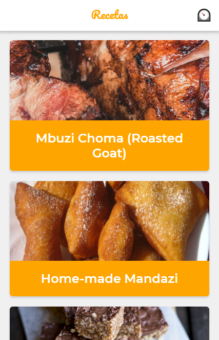

# Curso de PWA con Recat en Platzi

PWA que utiliza la API de MealDB para mostrar recetas con sus instrucciones. Algunas de las features que tiene son:

* Soporte Offline con Workbox
* Estrategias de Red apropiadas para cada recurso
* Add to Home Screen
* Web Share API

## Scripts

* `npm install` para instalar las dependencias
* `npm run dev` para entorno de desarrollo
* `npm run build && npm start` para producción

## Licencia

MIT

This peoject was bootstrapped with [Create React App](https://github.com/facebookincubator/create-react-app).